# Clínica Veterinaria "Huellitas" — API REST MVC

Aplicación de gestión veterinaria para registrar y consultar mascotas, construida con
**Java 21 + Spring Boot** siguiendo el patrón **MVC** y una **arquitectura por capas**,
con persistencia en **MariaDB** y pruebas de los endpoints desde **Postman**.

> Para este proyecto: *"La Vista será Postman, el Controlador es quien decide y el Modelo guarda."*

---

## Tabla de contenidos

1. [Arquitectura y estructura del proyecto](#1-arquitectura-y-estructura-del-proyecto)
2. [Trabajo de análisis (respuestas del taller)](#2-trabajo-de-análisis-respuestas-del-taller)
3. [Modelo de datos](#3-modelo-de-datos)
4. [Cómo ejecutar el proyecto](#4-cómo-ejecutar-el-proyecto)
5. [Endpoints de la API](#5-endpoints-de-la-api)
6. [Cómo probar en Postman](#6-cómo-probar-en-postman)
7. [Manejo de errores y códigos HTTP](#7-manejo-de-errores-y-códigos-http)
8. [Preguntas de sustentación](#8-preguntas-de-sustentación)

---

## 1. Arquitectura y estructura del proyecto

El proyecto separa responsabilidades en cuatro capas. Cada capa habla **solo con la de
abajo**, y la respuesta sube por el mismo camino hasta convertirse en una respuesta HTTP.

**Estructura de paquetes:**

```
com.huellitas
├── controller/     → MascotaController      (endpoints REST, entrada HTTP)
├── service/        → MascotaService         (reglas de negocio)
├── repository/     → MascotaRepository      (acceso a datos, interfaz JpaRepository)
├── model/          → Mascota, Estado        (entidad + enum de estados)
├── exception/      → RecursoNoEncontradoException
│                     ManejadorGlobalExcepciones  (traduce excepciones → códigos HTTP)
└── HuellitasApplication.java                (clase principal que arranca Spring Boot)
```

> **[ CAPTURA 1: estructura del proyecto en el IDE ]**

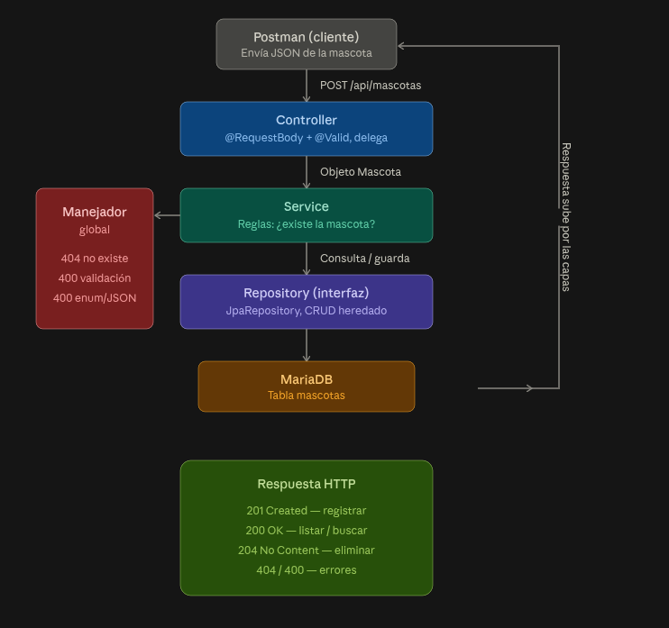

---

## 2. Trabajo de análisis (respuestas del taller)

**¿Qué información debe guardar el Modelo?**
El Modelo (`Mascota`) guarda los datos de cada paciente de la clínica: un identificador
único autoincremental (`id`), el `nombre`, el `tipo` (perro, gato, etc.), la `edad` y el
`estado` de salud. El estado se modeló como un **enum** con un conjunto cerrado de valores
válidos (`ENFERMO`, `HOSPITALIZADO`, `SANO`, `VACUNADO`), de modo que sea imposible guardar
un estado inválido.

**¿Qué responsabilidad tendrá el Controller?**
El Controller es el punto de entrada de las peticiones HTTP. Su responsabilidad es
**traducir entre el mundo HTTP y el mundo Java**: recibe la petición, convierte el JSON en
un objeto (`@RequestBody`), valida el formato de entrada (`@Valid`), delega la lógica al
Service y empaqueta el resultado en una respuesta HTTP con su código de estado correcto.
No contiene reglas de negocio.

**¿Qué información debería recibir el servidor cuando se registra una mascota?**
Un JSON con los datos de la mascota: `nombre`, `tipo`, `edad` y `estado`. **No** se envía el
`id`, porque lo genera automáticamente la base de datos (autoincremental).

```json
{
  "nombre": "Tobi",
  "tipo": "Perro",
  "edad": 6,
  "estado": "SANO"
}


```

**¿Qué debe devolver la aplicación cuando el registro se realiza correctamente?**
Debe devolver el código **`201 Created`** junto con el objeto de la mascota ya creada,
incluyendo el `id` que le asignó la base de datos. Así el cliente confirma que el recurso
se creó y conoce su identificador.


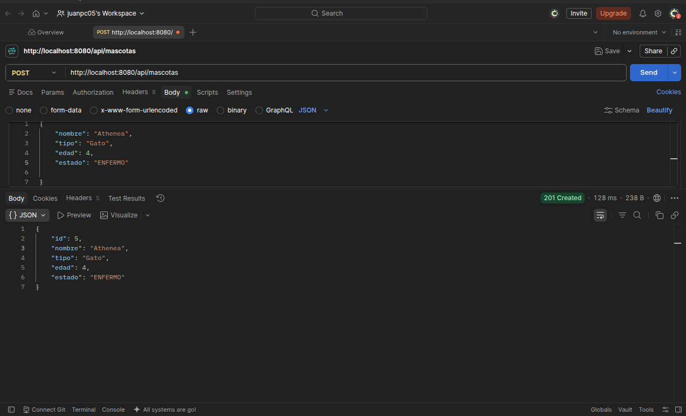

**¿Qué debería suceder si se consulta un ID que no existe?**
Normalmente, la aplicación devolvería un error generico `200` con un cuerpo vacío o `null`, sin embargo,
dentro de la clase service se agrego una excepción de dominio (`RecursoNoEncontradoException`) que 
el manejador global traduce a un **`404 NOT FOUND`** Con su respectivo mensaje de alerta más fácil de 
entender.
```json
{
    "error": "No existe el mascota con el id: 5"
}
```
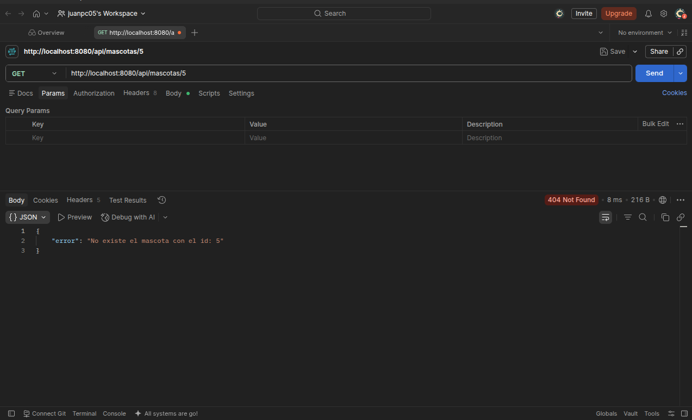
---

## 3. Modelo de datos

### Entidad `Mascota`

| Campo    | Tipo Java | Tipo SQL       | Notas                                    |
|----------|-----------|----------------|------------------------------------------|
| `id`     | `Long`    | `BIGINT`       | Clave primaria, autoincremental          |
| `nombre` | `String`  | `VARCHAR(255)` | Obligatorio (`@NotBlank`)                |
| `tipo`   | `String`  | `VARCHAR(255)` | Obligatorio (`@NotBlank`)                |
| `edad`   | `int`     | `INT`          | No puede ser negativo (`@Min(0)`)        |
| `estado` | `Estado`  | `VARCHAR(20)`  | Enum guardado como texto; obligatorio    |

### Enum `Estado`

Conjunto cerrado de valores válidos: `ENFERMO`, `HOSPITALIZADO`, `SANO`, `VACUNADO`.
Se guarda como texto en la base de datos (`@Enumerated(EnumType.STRING)`), de forma que la
columna almacena el nombre (por ejemplo `"SANO"`) y no un número de posición.

### Script de creación de la tabla

```sql
CREATE TABLE mascotas (
    id     BIGINT       NOT NULL AUTO_INCREMENT,
    nombre VARCHAR(255) NOT NULL,
    tipo   VARCHAR(255) NOT NULL,
    edad   INT          NOT NULL,
    estado VARCHAR(20)  NOT NULL,
    PRIMARY KEY (id),
    CONSTRAINT chk_estado CHECK (estado IN ('ENFERMO','HOSPITALIZADO','SANO','VACUNADO'))
);
```

> **[ CAPTURA 2: tabla `mascotas` con registros de prueba ]**
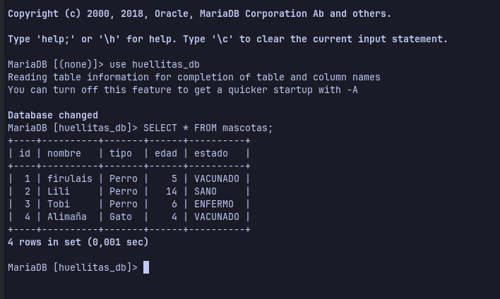

---

## 4. Cómo ejecutar el proyecto

### Requisitos previos

- **Java 21** (JDK) instalado.
- **MariaDB** instalada y en ejecución.
- **Maven** (viene incluido con el wrapper `./mvnw` del proyecto).
- **Postman** para probar los endpoints.

### Paso 1 — Crear la base de datos

Desde la terminal, entra a MariaDB y crea la base:

```bash
mariadb -u root -p
```

```sql
CREATE DATABASE huellitas_db;
USE huellitas_db;
-- luego ejecuta el CREATE TABLE de la sección 3
```

### Paso 2 — Configurar la conexión

En `src/main/resources/application.properties`:

```properties
# Conexión a MariaDB
spring.datasource.url=jdbc:mariadb://localhost:3306/huellitas_db
spring.datasource.username=${DB_USER}
spring.datasource.password=${DB_PASSWORD}
spring.datasource.driver-class-name=org.mariadb.jdbc.Driver

# JPA / Hibernate
spring.jpa.hibernate.ddl-auto=validate
spring.jpa.show-sql=true
spring.jpa.properties.hibernate.format_sql=true
```

> **Nota de seguridad:** el usuario y la contraseña se leen de variables de entorno
> (`${DB_USER}`, `${DB_PASSWORD}`) para no dejar credenciales escritas en el código. Defínelas
> en la configuración de ejecución del IDE (campo *Environment variables*) o exportándolas en
> la terminal antes de arrancar. Para probar rápido, también puedes reemplazar `${...}` por tus
> credenciales reales, pero **no subas esas credenciales al repositorio**.

### Paso 3 — Levantar la aplicación

Desde la raíz del proyecto:

```bash
./mvnw spring-boot:run
```

O desde IntelliJ, ejecutando la clase `HuellitasApplication`.

Si el arranque es correcto, verás en la consola una línea como:

```
Started HuellitasApplication in X.XXX seconds
Tomcat started on port 8080 (http)
```

La API queda disponible en: **`http://localhost:8080`**

> **[ CAPTURA 3: consola mostrando el arranque exitoso ]**
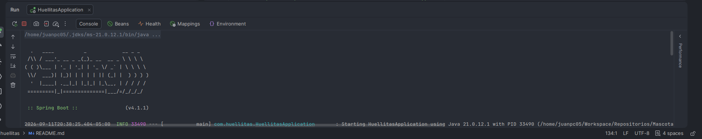

---

## 5. Endpoints de la API

Ruta base: `http://localhost:8080/api/mascotas`

| Método   | Ruta                  | Acción              | Éxito           |
|----------|-----------------------|---------------------|-----------------|
| `POST`   | `/api/mascotas`       | Registrar mascota   | `201 Created`   |
| `GET`    | `/api/mascotas`       | Listar todas        | `200 OK`        |
| `GET`    | `/api/mascotas/{id}`  | Buscar por ID       | `200 OK`        |
| `PUT`    | `/api/mascotas/{id}`  | Actualizar          | `200 OK`        |
| `DELETE` | `/api/mascotas/{id}`  | Eliminar            | `204 No Content`|

---

## 6. Cómo probar en Postman

Crea una colección llamada **`Clinica Veterinaria MVC`** y agrega una petición por cada
prueba. En cada una, configura el **método**, la **URL** y, cuando aplique, el **body**
(pestaña `Body` → `raw` → `JSON`).

### Prueba 1 — Crear (POST)

- **Método:** `POST`
- **URL:** `http://localhost:8080/api/mascotas`
- **Body (raw / JSON):**

```json
{
  "nombre": "Tobi",
  "tipo": "Perro",
  "edad": 6,
  "estado": "SANO"
}
```

- **Resultado esperado:** `201 Created` con el objeto creado (ya con su `id`).

> **[ CAPTURA 4: POST exitoso — se ve URL, método, body y código 201 ]**
> 

### Prueba 2 — Listar (GET)

- **Método:** `GET`
- **URL:** `http://localhost:8080/api/mascotas`
- **Resultado esperado:** `200 OK` con el arreglo de todas las mascotas.

> **[ CAPTURA 5: GET listar — se ve el arreglo con los registros ]**
> 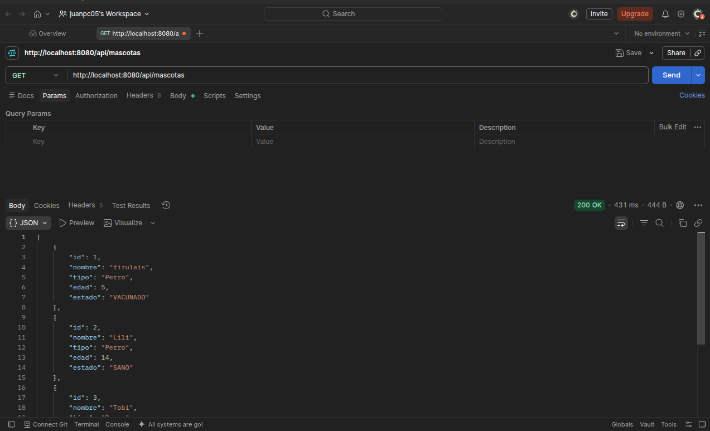

### Prueba 3 — Buscar por ID existente (GET)

- **Método:** `GET`
- **URL:** `http://localhost:8080/api/mascotas/1`
- **Resultado esperado:** `200 OK` con el objeto encontrado.

> **[ CAPTURA 6: GET por ID — se ve el objeto encontrado ]**
> 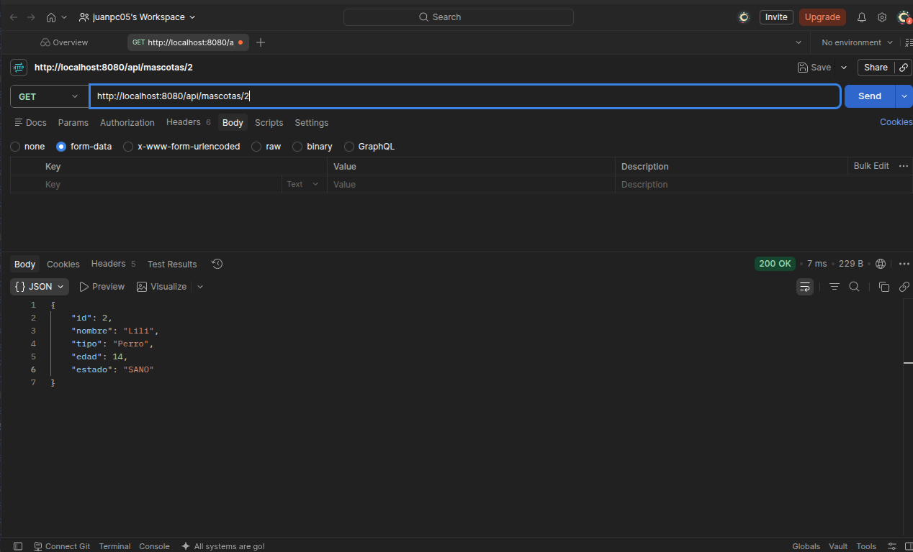

### Prueba 4 — Actualizar (PUT)

- **Método:** `PUT`
- **URL:** `http://localhost:8080/api/mascotas/1`
- **Body (raw / JSON):**

```json
{
  "nombre": "Tobi",
  "tipo": "Perro",
  "edad": 7,
  "estado": "VACUNADO"
}
```

- **Resultado esperado:** `200 OK` con el objeto ya actualizado.

> **[ CAPTURA 7: PUT — Actualizar]**
> > 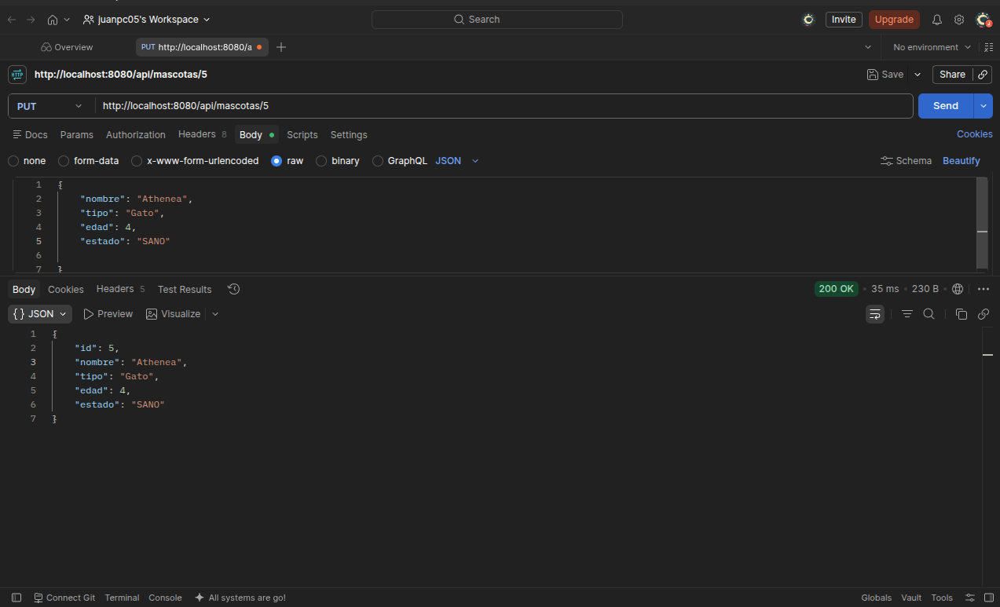

### Prueba 5 — Eliminar (DELETE)

- **Método:** `DELETE`
- **URL:** `http://localhost:8080/api/mascotas/1`
- **Resultado esperado:** `204 No Content` (respuesta sin cuerpo).

> **[ CAPTURA 8: DELETE — se ve el código 204 ]**
> > 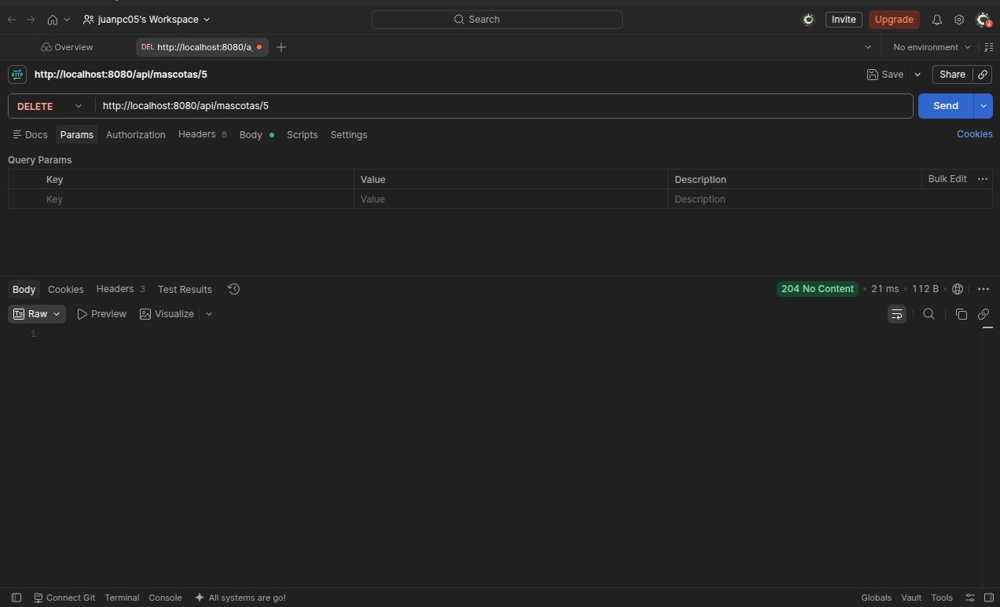

### Prueba 6 — Error: consultar ID inexistente (GET)

- **Método:** `GET`
- **URL:** `http://localhost:8080/api/mascotas/9999`
- **Resultado esperado:** `404 Not Found` con un mensaje de error.

> **[ CAPTURA 9: GET a ID inexistente — código 404 y mensaje ]**
> > 

### Prueba 7 — Validación: datos inválidos (POST)

Prueba dos casos de validación:

**7a. Campo obligatorio vacío / edad negativa** (lo atrapa `@Valid` → `400`):

```json
{
  "nombre": "",
  "tipo": "Perro",
  "edad": -3,
  "estado": "SANO"
}
```

**7b. Estado fuera del enum** (lo atrapa la deserialización → `400`):

```json
{
  "nombre": "Luna",
  "tipo": "Gato",
  "edad": 2,
  "estado": "ADOPTADO"
}
```

- **Resultado esperado en ambos:** `400 Bad Request` con un mensaje explicando el problema.

> **[ CAPTURA 10: POST inválido — código 400 y mensaje de validación ]**
> 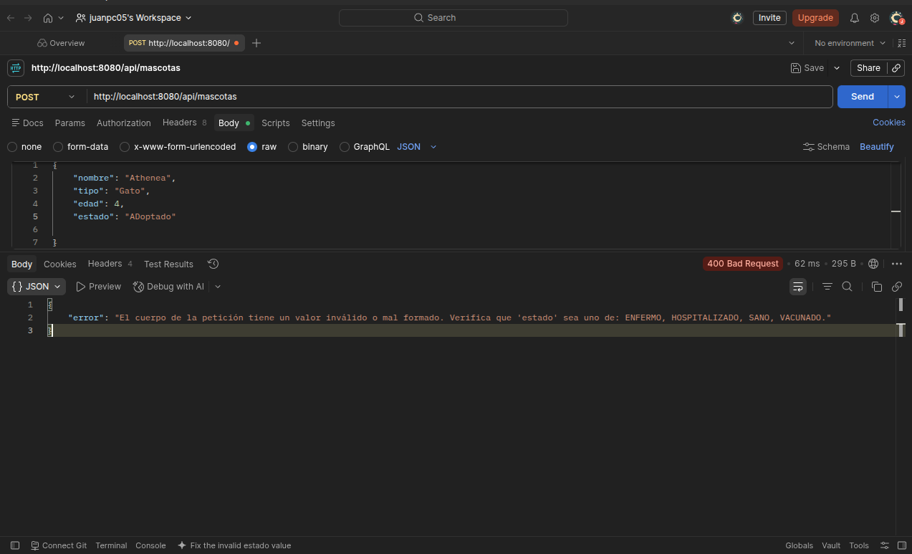
---

## 7. Manejo de errores y códigos HTTP

Los errores se manejan de forma **centralizada** en la clase
`ManejadorGlobalExcepciones` (anotada con `@RestControllerAdvice`), que traduce cada
excepción a su código HTTP correspondiente:

| Situación                          | Excepción capturada                  | Código HTTP        |
|------------------------------------|--------------------------------------|--------------------|
| Mascota no encontrada              | `RecursoNoEncontradoException`       | `404 Not Found`    |
| Validación de `@Valid` fallida     | `MethodArgumentNotValidException`    | `400 Bad Request`  |
| JSON ilegible / enum inválido      | `HttpMessageNotReadableException`    | `400 Bad Request`  |

Esto mantiene los controladores limpios (solo la ruta feliz) y centraliza el tratamiento
de errores en un único lugar.

---

## 8. Preguntas de sustentación

**¿Qué diferencia hay entre Modelo, Vista y Controller?**
El **Modelo** (`Mascota`) representa la entidad del negocio que vamos a construir en él definimos 
las reglas que este tendrá, sus atributos y aislamos estos para acceder solo por medio de get y set.
<br>
La **Vista** normalmente se trata de aquello con lo que el usuario podría interactuar, para el 
alcance de este proyecto solo será la interfaz gráfica de postman, desde aquí lanzamos las peticiones 
que son las cosas que queremos realizar.
<br>
El **Controller** es quien recibe la solicitud de la vista y coordina que hace con ella, delegando
la logica del negocio al **Service**


**¿Qué sucede cuando llega una petición POST?**
El Controller la recibe en `@PostMapping`. `@RequestBody` deserializa el JSON en un objeto
`Mascota` (vía Jackson) y `@Valid` verifica las reglas de validación. Si todo está bien, se
llama al Service, que aplica las reglas de negocio y usa el Repository para guardar en
MariaDB. Finalmente, el Controller devuelve `201 Created` con la mascota creada.

**¿Por qué no deberías colocar toda la lógica en el Controller?**
Porque cada clase tiene sus responsabilidades y centralizar todo en una sola clase hace que la página
sea menos mantenible con el tiempo, costando más hacer cambios grandes en su arquitectura como probar
otros canales para comunicarse con la base de datos, o implementar nuevas reglas de negocios, según las 
necesidades de la empresa.

**¿Qué código HTTP esperas al crear un recurso?**
`201 Created`, que indica que un nuevo recurso fue creado correctamente (en lugar del
genérico `200 OK`).

**¿Qué pasa si el ID que consultamos no existe?**
El Service lanza `RecursoNoEncontradoException`, que el manejador global traduce a
`404 Not Found` con un mensaje claro.

**¿Cómo comprobaste que tu API funciona?**
Mediante la colección de Postman `Clinica Veterinaria MVC`, probando cada endpoint: el caso
correcto de cada operación (crear, listar, buscar, actualizar, eliminar) y los casos de
error (consultar un ID inexistente y enviar datos inválidos), verificando en cada uno la
URL, el método, la respuesta y el código de estado.

---

## Reto adicional

**Agregar una funcionalidad útil**

Se agrega como funcionalidad extra el filtrado de las mascotas por el estado en que se encuentran
esto permite a la veterinaria ser conscientes de los animales que tienen hospitalizados, enfermos, vacunados, etc

Para lograr esto, springboot y JPA permiten agregar a la interfaz del repository una consulta que se convierte
automaticamente a SQL con solo esta linea

`List<Mascota> findByEstado(Estado estado);`

Para buscar en postman no se puede utilizar `api/Estado` e invocar el estado, dado que el GetMapping al
reconocer esta estructura fallará, para eso se utiliza una ruta segura que evite este error de `api/algo`
y dejamos la ruta `/api/estado/estado`

> **[ CAPTURA 11: Funcionalidad extra ]**
> 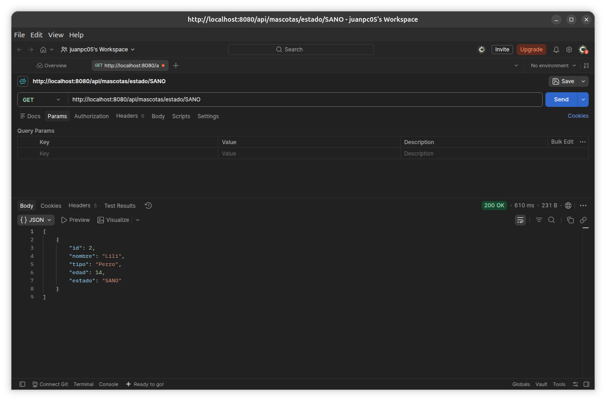

---

## Autor

- **Estudiante:** Juan Pablo Castillo Rueda
- **Proyecto:** Clínica Veterinaria MVC — Java / Spring Boot / API REST / Postman